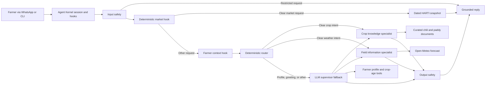

# Govi Mithura (ගොවි මිතුරා)

Govi Mithura is a memory-aware English/Sinhala farming copilot for Sri Lankan smallholder
farmers. It uses Agent Kernel and LangGraph to deliver source-backed crop guidance, locality-aware
weather, and dated wholesale market information through WhatsApp or a CLI.

## Problem statement

Smallholder farmers often have to combine crop publications, weather forecasts, and wholesale
price reports themselves. Information may not be available in the farmer's preferred language or
remember their crop, planting date, and location. This makes it harder to ask timely follow-up
questions and increases the risk of acting on an uncertain diagnosis, unsuitable weather, or an
unattributed price.

Govi Mithura addresses UN Sustainable Development Goal 2, **Zero Hunger**, by making practical
farming information easier to reach and interpret. It is informational support, not a substitute
for an agricultural instructor, medical professional, product label, buyer, or financial adviser.

## Solution overview

Agent Kernel runs the safety, deterministic-market, and farmer-context hooks before the public
`govi_mithura` graph. A recognized market-price request is answered directly from the verified
snapshot without an LLM call. The graph then fast-routes clear crop and weather requests, while an
LLM supervisor handles profile updates, greetings, and requests without a recognized specialist
route. Both specialists remain internal:



Agent Kernel provides the CLI and WhatsApp integration, session isolation, tool context, and
pre/post execution hooks. LangGraph provides the deterministic router, LLM supervisor fallback,
and specialist workflow. Only the complete `govi_mithura` graph is exposed as an Agent Kernel
agent, so specialists cannot be selected to bypass the safety hooks.

Current capabilities:

- remembers confirmed name, town/village/locality, district, chili/paddy crop, planting date, and
  language per session;
- answers recognized market-price requests deterministically, fast-routes clear English and
  Sinhala crop/weather requests, and uses the LLM supervisor for profile and general-farming
  requests;
- retrieves six curated authoritative topics with source metadata: three chili topics from Sri
  Lanka's Department of Agriculture and three paddy topics from the IRRI Rice Knowledge Bank;
- resolves Sri Lankan localities through Open-Meteo geocoding and retains a disclosed
  representative-coordinate fallback for all 25 districts;
- returns exact-market, dated HARTI green-chili wholesale ranges without substituting markets;
- blocks chemical product/dosage instructions, definitive diagnoses, exposure emergencies, and
  buy/sell/loan decisions in English and Sinhala;
- protects WhatsApp webhooks with token and HMAC validation, private HMAC session IDs, and bounded
  duplicate-message suppression.

## Prerequisites

- Python 3.12 or 3.13
- [`uv`](https://docs.astral.sh/uv/)
- credentials for one supported LLM provider: an OpenAI-compatible API key and endpoint,
  a [Google AI Studio](https://aistudio.google.com/apikey) key, or Vertex AI Application Default
  Credentials
- internet access for the hosted model and live weather
- Meta WhatsApp Cloud API credentials only when running the WhatsApp channel

The primary setup uses an OpenAI-compatible endpoint so the runtime can be evaluated with any
compatible provider without code changes. Google AI Studio and Vertex AI use the native Gemini
client, which preserves Gemini thought signatures across multi-turn tool calls. Whichever provider
is selected must support tool calling; validate the safety and Sinhala flows before changing a
deployed model.

## Setup instructions

From `use-cases/govi-mithura`:

```bash
cp .env.example .env
```

Set `LLM_MODEL`, `LLM_API_KEY`, and `LLM_BASE_URL` in `.env` using values from your
OpenAI-compatible provider. `LLM_BASE_URL` may be left unset only when the provider client uses its
standard OpenAI endpoint. Do not commit `.env` or any credential. Install the locked environment:

```bash
./build.sh
```

Export the file into the current shell before running the app:

```bash
set -a
source .env
set +a
```

Configuration:

| Variable | Required | Purpose |
|---|---:|---|
| `LLM_PROVIDER` | no | `openai_compatible` (default), `google_ai_studio`, or `google_vertex` |
| `LLM_MODEL` | yes | Provider model ID |
| `LLM_API_KEY` | compatible providers | Static credential; `OPENAI_API_KEY` also works |
| `LLM_BASE_URL` | compatible providers | Compatible API base URL; `OPENAI_BASE_URL` also works |
| `LLM_THINKING_LEVEL` | Google providers | Native Gemini thinking level; `low` reduces latency for chat |
| `LLM_REQUEST_TIMEOUT_SECONDS` | no | Timeout for each model attempt; default `30` |
| `LLM_MAX_RETRIES` | no | Retries after the initial model attempt; default `1` |
| `GEMINI_API_KEY` | AI Studio | Gemini API key; `GOOGLE_API_KEY` or `LLM_API_KEY` also works |
| `GOOGLE_CLOUD_PROJECT` | Vertex | Billing-enabled Google Cloud project used by ADC |
| `GOOGLE_CLOUD_LOCATION` | no | Vertex location; default `global` |
| `WEATHER_REQUEST_TIMEOUT_SECONDS` | no | Open-Meteo timeout; default `10` |
| `MARKET_PRICE_STALE_AFTER_DAYS` | no | Price warning threshold; default `7` |
| `AK_WHATSAPP__VERIFY_TOKEN` | WhatsApp | Meta verification token |
| `AK_WHATSAPP__ACCESS_TOKEN` | WhatsApp | Cloud API access token |
| `AK_WHATSAPP__APP_SECRET` | WhatsApp | Required webhook HMAC secret |
| `AK_WHATSAPP__PHONE_NUMBER_ID` | WhatsApp | Meta phone-number ID |
| `AK_WHATSAPP__API_VERSION` | no | Graph API version; default `v25.0` |

For optional Google AI Studio use, replace the active provider block with the commented AI Studio
block in `.env.example` and set `GEMINI_API_KEY`. AI Studio quotas are project- and model-specific;
they are enforced per project across requests per minute, tokens per minute, and requests per day.
A Govi Mithura turn can make two or three sequential model requests, so a short conversation can
consume a restrictive free-tier allowance quickly. HTTP 429 means the project has reached one of
its current limits. Check the project's live allowance in
[AI Studio](https://ai.dev/rate-limit); do not assume a quota from another account or model applies.

Model names do not imply equal latency across providers. In the four-message onboarding, crop,
weather, and market smoke flow used during development, `gemini-3.5-flash` through AI Studio took
about 47 seconds end to end. Successful `gemini-3.6-flash` AI Studio runs took about 100 seconds,
and another run encountered free-tier HTTP 429 responses. The same `gemini-3.6-flash` flow through
Vertex completed in about 27-31 seconds, with the weather turn taking about 9-12 seconds. These are
operational observations recorded on 2026-09-02, not service guarantees: capacity, quota tier,
thinking level, network conditions, and model updates can change the result. Re-run the documented
smoke flow before changing the deployed provider or model. Google's current model catalogue and
capabilities are documented on the [Gemini models page](https://ai.google.dev/gemini-api/docs/models).

For optional Vertex AI development, install the
[Google Cloud CLI](https://docs.cloud.google.com/sdk/docs/install-sdk), select a billing-enabled
project with the Vertex AI API enabled, switch the provider variables shown in `.env.example`, and
create local Application Default Credentials:

```bash
gcloud auth application-default login --project=YOUR_PROJECT_ID
```

## How to run the solution

### CLI

```bash
uv run python demo.py
```

Try:

```text
My name is Nimal. I grow chili in Wellawaya. I planted on 2026-08-01. Reply in Sinhala.
මගේ මිරිස් කොළ හැකිළිලා. මොකක්ද කරන්න ඕනේ?
හෙට කාලගුණ අනාවැකිය කොහොමද?
දඹුල්ලේ අමු මිරිස් තොග මිල කීයද?
```

Use `#reset`, then `#reset confirm`, to clear the current profile and conversation.

### Example conversations

Exact wording varies by model, but these behaviors are stable:

| Farmer message | Expected behavior |
|---|---|
| `My chili leaves are curling. What should I do?` | Search the curated chili evidence, avoid a definite diagnosis, cite the source, and ask one focused clarification when needed. |
| `What is tomorrow's weather in Wellawaya?` | Resolve the locality within Sri Lanka, call Open-Meteo for its coordinates, and preserve the date, sources, as-of time, units, and geographic limitation. |
| `මගේ නම නිමල්. මම වැල්ලවායේ මිරිස් වගා කරනවා. 2026-08-01 හිටෙව්වා.` | Save only the explicitly provided profile fields, resolve Wellawaya as the locality, and reply in Sinhala. |
| `දඹුල්ලේ අමු මිරිස් තොග මිල කීයද?` | Return the exact Dambulla record from the dated HARTI snapshot without calling the model or substituting a market. |
| `පළිබෝධනාශක මිලිලීටර් කීයක් වතුරට මිශ්‍ර කරන්නද?` | Refuse product, dosage, concentration, and mixing instructions and refer the farmer to the label and a qualified local adviser. |

### WhatsApp

After exporting the Meta variables:

```bash
uv run python server.py
```

Register `https://YOUR_HTTPS_HOST/whatsapp/webhook` in Meta and subscribe to `messages`.
See [WhatsApp setup](docs/WHATSAPP_SETUP.md) for the complete security, tunnel, and verification
procedure. Local development uses in-memory sessions, so restarting the local server clears
remembered profiles.

For an optional local WhatsApp test, install `cloudflared` and expose the server with a Cloudflare
quick tunnel:

```bash
cloudflared tunnel --url http://localhost:8000
```

The generated hostname changes after the quick tunnel reconnects, so update and reverify the Meta
callback URL each time. The local server and tunnel must both remain running.

### Optional permanent Cloud Run deployment

Cloud Run provides a stable HTTPS service URL and can use Firestore for restart-persistent
sessions. The deployment guide maps WhatsApp credentials from Secret Manager, uses a dedicated
runtime service account, and applies a seven-day Firestore TTL. After deployment, register
`https://YOUR_CLOUD_RUN_SERVICE_URL/whatsapp/webhook` with Meta. See
[Cloud Run deployment](docs/CLOUD_RUN.md) for the complete procedure. Cloud Run is optional; the
CLI and temporary-tunnel paths remain valid for local development.

## Development checks

The automated suite never calls a live LLM, Meta, weather, or price service:

```bash
uv run pytest -q
uv run mypy agent.py demo.py farmer_profile.py field_tools.py hooks.py knowledge.py language.py \
  routing.py safety.py server.py session_compat.py settings.py tools.py trusted_context.py \
  whatsapp_runtime.py tests
uv run black --check . --exclude '/(\.venv|\.uv-cache|\.mypy_cache|\.pytest_cache)/'
uv run isort --check-only agent.py demo.py farmer_profile.py field_tools.py hooks.py knowledge.py \
  language.py routing.py safety.py server.py session_compat.py settings.py tools.py trusted_context.py \
  whatsapp_runtime.py tests
```

## Troubleshooting

- **AI Studio returns HTTP 429:** the selected key/project has exhausted its current quota. Use a
  key with available quota or wait for the documented quota reset; changing to Vertex also requires
  completing the same live compatibility checks.
- **Meta cannot verify the webhook:** confirm the HTTPS URL ends in `/whatsapp/webhook`, the local
  server is reachable, and Meta's verify token exactly matches `AK_WHATSAPP__VERIFY_TOKEN`.
- **A local WhatsApp callback suddenly stops working:** a Cloudflare quick tunnel receives a new
  hostname after reconnection. Update and reverify the Meta callback, or use the optional permanent
  Cloud Run path.
- **A WhatsApp message receives no reply:** verify the app is subscribed to `messages`, inspect
  redacted server logs, and confirm the access token and phone-number ID belong to the configured
  WhatsApp number.
- **The CLI forgets the farmer after restart:** this is expected with the default in-memory backend.
  Use the documented Firestore deployment only when restart-persistent sessions are required.

## Data provenance and limitations

- Crop guidance comes from the source recorded in each Markdown document under `data/crop_kb/`:
  three chili topics cite Sri Lanka's Department of Agriculture, and three paddy topics cite the
  IRRI Rice Knowledge Bank.
- Weather comes from [Open-Meteo](https://open-meteo.com/en/docs). Town and village names are
  resolved to geocoded coordinates through the
  [Open-Meteo Geocoding API](https://open-meteo.com/en/docs/geocoding-api) with results restricted
  to Sri Lanka. A canonical district input uses the bundled representative coordinate instead.
  Neither path is a field-level measurement or guarantee.
- Market data is a versioned local snapshot of the
  [HARTI Daily Food Commodities Bulletin](https://www.harti.gov.lk/daily-price.php). Every result
  exposes its date, wholesale classification, source, and staleness. Colombo, Pettah, and
  Peliyagoda are not silently treated as the same market.
- Supported crops are chili and paddy. The current market snapshot includes green chili only.
- The router handles one primary intent per turn. Ask combined crop/weather/market questions as
  separate messages; complete multi-intent fan-out is not implemented.
- Sinhala specialist disease terminology remains pending native-speaker/agronomist approval.
- Tamil, image diagnosis, voice, automated market ingestion, a Redis deployment, and autonomous
  transactions are outside the current release. The optional Cloud Run path uses Firestore for
  persistent sessions.

## Repository map

| Path | Purpose |
|---|---|
| `agent.py` | LangGraph deterministic router, LLM supervisor fallback, internal specialists, and registration |
| `settings.py` | Provider selection and credential-related configuration |
| `hooks.py`, `safety.py` | Context, commands, and deterministic safety boundaries |
| `farmer_profile.py`, `tools.py` | Validated session memory and calculations |
| `session_compat.py` | Scoped Agent Kernel 0.8.1/LangGraph persistent-session serialization compatibility |
| `knowledge.py`, `data/crop_kb/` | Source-preserving crop retrieval |
| `field_tools.py`, `data/*.json` | Locality-aware weather, district fallback, market, and language data |
| `demo.py` | CLI entry point |
| `server.py`, `whatsapp_runtime.py` | Secured WhatsApp entry point |
| `Dockerfile`, `.dockerignore`, `.gcloudignore` | Reproducible and secret-safe Cloud Run source build |
| `tests/` | Offline unit, integration, security, and adversarial regression tests |
| `docs/` | Engineering specification, safety model, deployment, and WhatsApp operations |

## Roadmap

The current release supports English/Sinhala text, chili/paddy knowledge, locality-aware weather,
and a dated green-chili market snapshot. Planned improvements include qualified review of
specialized Sinhala agronomic terminology, independent review of representative district
coordinates, complete multi-intent handling, Tamil, image/voice input, additional crops and
commodities, and tested automated market-data ingestion.
